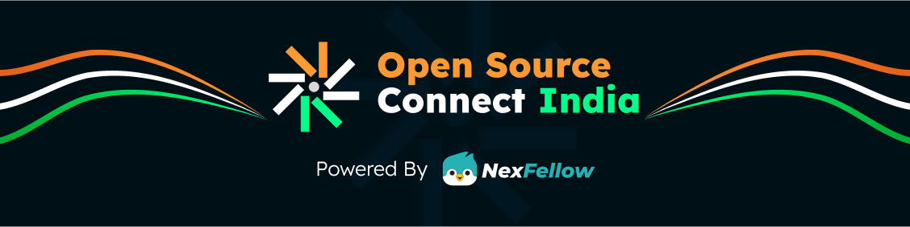

<p align="center">
  
</p>

# [RAKTDAAN 🩸](https://raktdaanorg.netlify.app/)
*Where You Bond By Blood - Connecting Blood Donors & Recipients Instantly*


---

## 🌟 Project Overview

**RAKTDAAN** is a comprehensive, real-time blood donation platform that seamlessly connects **donors, recipients, hospitals, and administrators** through an advanced centralized system. Built with modern technologies and designed with responsiveness, urgency, and simplicity in mind, it helps bridge the life-saving gap in critical moments while providing robust management tools for healthcare institutions.

> 💡 _"One unit of blood can save up to three lives. Be the reason someone lives. Be a donor. Be a hero."_

---

## 🚀 Live Demo

👉 [Visit the Live Site](https://raktdaanorg.netlify.app/)

---

## 🎯 Project Purpose

- Facilitate **real-time donor-recipient matching** with location-based services
- Enable **emergency blood requests (SOS)** from hospitals or individuals
- Maintain comprehensive **donation history** and **availability status**
- Provide a secure **admin dashboard** with team management capabilities
- Support **file uploads** for donor verification and documentation
- Implement **real-time notifications** for urgent blood requests
- Encourage and organize **voluntary blood donation campaigns**

---

## 📋 Advanced Features

### 🧑‍💉 Donor Features
- **Secure Registration**: Complete donor profile with ID verification
- **Real-time Availability**: Location-based status updates and availability toggle
- **Donation History**: Track past donations and eligibility status
- **Live Alerts**: Receive instant notifications for nearby SOS requests
- **Document Upload**: Submit ID proofs and donation certificates
- **Profile Verification**: Admin-verified donor status system

### 🏥 Hospital Features
- **Emergency SOS System**: Create and manage urgent blood requests
- **Inventory Management**: Track blood bank status and requirements
- **Donor Matching**: Advanced filtering by blood group, location, and availability
- **Request Tracking**: Monitor status of blood requests in real-time
- **Verification System**: Hospital registration with admin approval

### 🚨 Emergency & Alert System
- **Location-based Matching**: GPS-powered donor-recipient proximity matching
- **Real-time Notifications**: Instant push notifications to available donors
- **SOS Broadcasting**: Emergency alerts sent to multiple donors simultaneously
- **Response Tracking**: Monitor donor responses to emergency requests

### 🛡️ Enhanced Admin Dashboard
- **User Management**: Verify and manage donor/hospital registrations
- **Team Management**: Add team members with role-based access control
- **System Analytics**: Real-time statistics and usage metrics
- **Document Verification**: Review and approve ID documents and certificates
- **Role Management**: Assign roles (Member, Moderator, Team Lead)
- **Department Organization**: Group team members by departments
- **Activity Monitoring**: Track system usage and user engagement

### 🎨 UI/UX Features
- **Modern Design**: Medical-style interface with gradient cards
- **Responsive Layout**: Mobile-first design with adaptive navigation
- **Real-time Updates**: Live data synchronization across all components
- **Notification System**: Toast notifications and popup alerts
- **Scroll to Top**: Enhanced navigation with smooth scrolling
- **Loading States**: Professional loading indicators and transitions

---

## 🛠️ Tech Stack

| Layer         | Technology                                    |
|---------------|-----------------------------------------------|
| **Frontend**  | React 19, TypeScript, Vite, Tailwind CSS     |
| **Backend**   | [Convex](https://www.convex.dev) (Real-time) |
| **Authentication** | Convex Auth with Firebase integration   |
| **File Storage** | Firebase Storage & Convex File Storage    |
| **Services**  | Geolocation API, Push Notifications          |
| **UI Components** | Lucide React, Framer Motion, Sonner      |
| **Hosting**   | Netlify (CI/CD + Live Deployment)            |
| **Development** | ESLint, Prettier, npm-run-all              |

---

## 🚀 Getting Started

### 🔧 Prerequisites
- Node.js ≥ 18
- Git
- Convex CLI
- Firebase CLI (optional)

### 📥 Clone the Repository
```bash
git clone https://github.com/Aditya-Karmalkar/RAKTDAAN.git
cd RAKTDAAN
npm install
```

### 🔐 Environment Setup

Create a `.env` file in the root directory and add:
```env
VITE_CONVEX_URL=your_convex_url
VITE_FIREBASE_API_KEY=your_key
VITE_FIREBASE_AUTH_DOMAIN=your_auth_domain
```

### 🖥️ Start Development Server
```bash
npm run dev
```

Visit: `http://localhost:5173`

---

## 📁 Project Structure

```
RAKTDAAN/
├── public/                    # Static assets and images
├── src/
│   ├── components/           # Reusable UI components (30+ components)
│   │   ├── AdminDashboard.tsx
│   │   ├── DonorRegistration.tsx
│   │   ├── HospitalRegistration.tsx
│   │   ├── SosAlert.tsx
│   │   ├── LiveDonorAlert.tsx
│   │   ├── NotificationPopup.tsx
│   │   └── ScrollToTopButton.tsx
│   ├── firebase/            # Firebase configuration and auth
│   ├── hooks/               # Custom React hooks
│   ├── lib/                 # Utility libraries
│   └── types/               # TypeScript type definitions
├── convex/                  # Backend logic & database schema
│   ├── schema.ts            # Database schema definitions
│   ├── admin.ts             # Admin management functions
│   ├── donors.ts            # Donor-related operations
│   ├── hospitals.ts         # Hospital management
│   ├── campaigns.ts         # Blood donation campaigns
│   ├── teams.ts             # Team management system
│   └── fileStorage.ts       # File upload handling
├── .env.example             # Environment variables template
├── netlify.toml             # Netlify deployment configuration
├── vite.config.ts           # Vite build configuration
└── tailwind.config.js       # Tailwind CSS configuration
```

---

## 🔧 Advanced Development Features

### 📊 Database Schema
- **User Verification System**: Complete ID verification workflow
- **Donor Verification**: Specialized donor document verification
- **Team Management**: Role-based team member organization
- **File Storage**: Secure document and image storage
- **Gallery System**: Photo carousel for campaigns and events
- **Testimonials**: User success stories and feedback

### 🚀 Development Scripts
```bash
npm run dev              # Start both frontend and backend
npm run dev:frontend     # Start only Vite development server
npm run dev:backend      # Start only Convex backend
npm run build           # Production build
npm run build:netlify   # Netlify-specific build
npm run deploy-check    # Pre-deployment validation
npm run lint           # Code linting and type checking
```

### 🔐 Security Features
- **JWT Authentication**: Secure user sessions
- **Role-based Access Control**: Admin, donor, and hospital roles
- **Document Verification**: ID proof validation system
- **Secure File Uploads**: Protected document storage
- **Input Validation**: Comprehensive form validation

---

## 🤝 Contributing

We welcome contributions from developers, designers, and volunteers!

### How to Contribute:
1. Fork this repository
2. Create your feature branch: `git checkout -b feature/YourFeature`
3. Commit your changes: `git commit -m "Add some feature"`
4. Push to the branch: `git push origin feature/YourFeature`
5. Open a pull request

📬 Questions or ideas? Use [issues](https://github.com/Aditya-Karmalkar/RAKTDAAN/issues) to start a discussion.

---

## 🙏 Acknowledgments

- [Convex.dev](https://convex.dev) for serverless backend with real-time updates  
- [Firebase](https://firebase.google.com/) for easy auth and storage  
- [Tailwind CSS](https://tailwindcss.com/) for rapid UI development  
- Inspired by India's [RaktDaan Amrit Mahotsav](https://www.nhm.gov.in)

---

## 📄 License

This project is licensed under the [MIT License](LICENSE).

---

> Made with ❤️ by [Aditya Karmalkar](https://github.com/Aditya-Karmalkar)