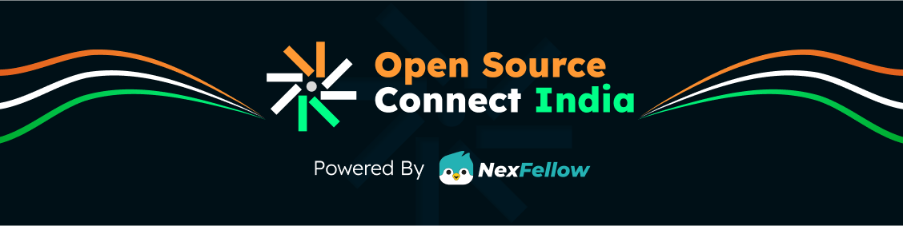

<<<<<<< HEAD
# React + Vite

This template provides a minimal setup to get React working in Vite with HMR and some ESLint rules.

Currently, two official plugins are available:

- [@vitejs/plugin-react](https://github.com/vitejs/vite-plugin-react/blob/main/packages/plugin-react) uses [Babel](https://babeljs.io/) for Fast Refresh
- [@vitejs/plugin-react-swc](https://github.com/vitejs/vite-plugin-react/blob/main/packages/plugin-react-swc) uses [SWC](https://swc.rs/) for Fast Refresh

## Expanding the ESLint configuration

If you are developing a production application, we recommend using TypeScript with type-aware lint rules enabled. Check out the [TS template](https://github.com/vitejs/vite/tree/main/packages/create-vite/template-react-ts) for information on how to integrate TypeScript and [`typescript-eslint`](https://typescript-eslint.io) in your project.
=======
<p align="center">
  
</p>

# [RAKTDAAN 🩸](https://raktdaanorg.netlify.app/)
*Connecting Blood Donors & Recipients Instantly*


---

## 🌟 Project Overview

**RAKTDAAN** is a real-time blood donation platform that connects **donors, recipients, hospitals, and administrators** through a centralized system. Designed with responsiveness, urgency, and simplicity in mind, it helps bridge the life-saving gap in critical moments.

> 💡 _“One unit of blood can save up to three lives. Be the reason someone lives. Be a donor. Be a hero.”_

---

## 🚀 Live Demo

👉 [Visit the Live Site](https://raktdaanorg.netlify.app/)

---

## 🎯 Project Purpose

- Facilitate **real-time donor-recipient matching**
- Enable **emergency blood requests (SOS)** from hospitals or individuals
- Maintain **donation history** and **availability status**
- Provide a secure **admin dashboard** for management
- Encourage and organize **voluntary blood donation**

---

## 📋 Features

### 🧑‍💉 Donor Features
- Secure donor registration
- Real-time location and availability status updates
- View donation history
- Receive alerts for nearby SOS requests

### 🏥 Hospital Features
- Create emergency SOS requests
- Manage blood inventory and requests
- View matched donors by blood group and location

### 🚨 Emergency System
- Location-based matching of donors and recipients
- Real-time alerts to available donors

### 🛡️ Admin Dashboard
- Verify and manage donor/hospital registrations
- Monitor real-time SOS requests
- Manage roles and access control

---

## 🛠️ Tech Stack

| Layer         | Technology                          |
|---------------|--------------------------------------|
| **Frontend**  | React 19, Vite, Tailwind CSS         |
| **Backend**   | [Convex](https://www.convex.dev)     |
| **Services**  | Firebase (Auth & Uploads), Geo API   |
| **Hosting**   | Netlify (CI/CD + Live Deployment)    |

---

## 🚀 Getting Started

### 🔧 Prerequisites
- Node.js ≥ 18
- Git
- Convex CLI
- Firebase CLI (optional)

### 📥 Clone the Repository
```bash
git clone https://github.com/Aditya-Karmalkar/RAKTDAAN.git
cd RAKTDAAN
npm install
```

### 🔐 Environment Setup

Create a `.env` file in the root directory and add:
```env
VITE_CONVEX_URL=your_convex_url
VITE_FIREBASE_API_KEY=your_key
VITE_FIREBASE_AUTH_DOMAIN=your_auth_domain
```

### 🖥️ Start Development Server
```bash
npm run dev
```

Visit: `http://localhost:5173`

---

## 📁 Project Structure

```
RAKTDAAN/
├── public/
├── src/
│   ├── components/        # Reusable UI components
│   ├── pages/             # Page-level components
│   ├── convex/            # Backend logic & DB interactions
│   ├── firebase/          # Firebase config & auth
│   └── utils/             # Geolocation, validators, etc.
├── .env
└── vite.config.js
```

---

### ✅ Admin Features
- Manage users (Donors, Hospitals)
- Track SOS alerts
- View usage statistics
- Moderate activity and update data

---

## 🤝 Contributing

We welcome contributions from developers, designers, and volunteers!

### How to Contribute:
1. Fork this repository
2. Create your feature branch: `git checkout -b feature/YourFeature`
3. Commit your changes: `git commit -m "Add some feature"`
4. Push to the branch: `git push origin feature/YourFeature`
5. Open a pull request

📬 Questions or ideas? Use [issues](https://github.com/Aditya-Karmalkar/RAKTDAAN/issues) to start a discussion.

---

## 🙏 Acknowledgments

- [Convex.dev](https://convex.dev) for serverless backend with real-time updates  
- [Firebase](https://firebase.google.com/) for easy auth and storage  
- [Tailwind CSS](https://tailwindcss.com/) for rapid UI development  
- Inspired by India's [RaktDaan Amrit Mahotsav](https://www.nhm.gov.in)

---

## 📄 License

This project is licensed under the [MIT License](LICENSE).

---

> Made with ❤️ by [Aditya Karmalkar](https://github.com/Aditya-Karmalkar)
>>>>>>> upstream/main
